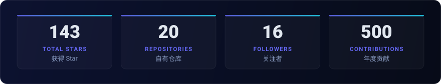
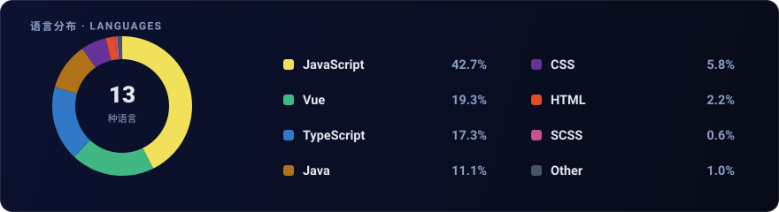

  

  

 

## 关于我 · About

> **从 0 到 1 拆解 AI Agent，用前端工程化的方式把它讲清楚。**
> *Reverse-engineering AI agents from scratch, and explaining them the frontend-engineering way.*

我是一名前端工程师，日常在 **TypeScript / Vue / React** 里打滚，业余时间基本都花在拆解 AI Agent 的源码上。
`build-claude-code` 是我把这个过程完整写下来的项目——不讲玄学，只讲它到底怎么跑起来的。

I'm a frontend engineer working mostly in **TypeScript / Vue / React**. Outside of work I spend my time
taking AI agents apart and writing down how they actually work. No hand-waving — just the source.

 

## 技术栈 · Tech Stack

  

  
  
  
  
  
  

 

## 精选项目 · Featured Projects

| 项目 Project | 简介 Description | 技术 |
| :--- | :--- | :--- |
| **[build-claude-code](https://github.com/OPBR/build-claude-code)** | 从 0 到 1 构建 Claude Code（学习版） *Build Claude Code from scratch, as a learning project* | `TypeScript` |
| **[multi-table](https://github.com/OPBR/multi-table)** | 多维表格，同时支持 Vue / React 版本 *Multi-dimensional table for both Vue and React* | `TypeScript` |
| **[vite-plugin-typed-env](https://github.com/OPBR/vite-plugin-typed-env)** | 自动生成类型 + 运行时校验的环境变量插件 *Typed env vars for Vite with runtime validation* | `TypeScript` |
| **[vite-plugin-build-time](https://github.com/OPBR/vite-plugin-build-time)** | 把构建时间注入 meta 标签 *Inject build time into the meta tag* | `TypeScript` |
| **[chat-composer](https://github.com/OPBR/chat-composer)** | 对话式输入组件 *A chat composer component* | `TypeScript` |
| **[opbr-skills](https://github.com/OPBR/opbr-skills)** | AI Agent 技能集 *Agent skills collection* | — |

  

 

## 数据 · Stats

  

  

  

<!-- 上面两张 SVG 由 scripts/generate-stats.mjs 生成，GitHub Action 每日自动刷新，数据不会过期。 -->

 

## 联系 · Connect

<!-- 把下面的 mailto 和链接换成你自己的： -->

  

 

  

  Read the source. Build the thing. · 读源码，造轮子。

